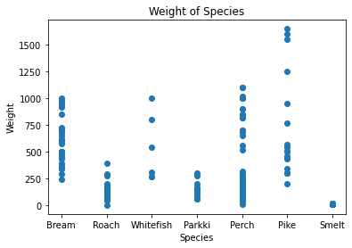
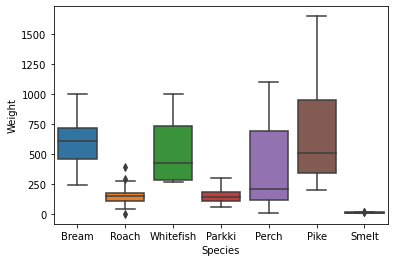

```python
import pandas as pd
import numpy as np
import matplotlib.pyplot as plt
```

# 데이터 프레임 불러오기


```python
df_fish = pd.read_csv("Fish.csv")
```

# 데이터 확인


```python
df_fish.shape # (행, 열)
```


    (159, 7)


```python
df_fish.head() # 위의 5개정도만 빼서 확인
```


<div>
<style scoped>
    .dataframe tbody tr th:only-of-type {
        vertical-align: middle;
    }

    .dataframe tbody tr th {
        vertical-align: top;
    }

    .dataframe thead th {
        text-align: right;
    }
</style>
<table border="1" class="dataframe">
  <thead>
    <tr style="text-align: right;">
      <th></th>
      <th>Species</th>
      <th>Weight</th>
      <th>Length1</th>
      <th>Length2</th>
      <th>Length3</th>
      <th>Height</th>
      <th>Width</th>
    </tr>
  </thead>
  <tbody>
    <tr>
      <th>0</th>
      <td>Bream</td>
      <td>242.0</td>
      <td>23.2</td>
      <td>25.4</td>
      <td>30.0</td>
      <td>11.5200</td>
      <td>4.0200</td>
    </tr>
    <tr>
      <th>1</th>
      <td>Bream</td>
      <td>290.0</td>
      <td>24.0</td>
      <td>26.3</td>
      <td>31.2</td>
      <td>12.4800</td>
      <td>4.3056</td>
    </tr>
    <tr>
      <th>2</th>
      <td>Bream</td>
      <td>340.0</td>
      <td>23.9</td>
      <td>26.5</td>
      <td>31.1</td>
      <td>12.3778</td>
      <td>4.6961</td>
    </tr>
    <tr>
      <th>3</th>
      <td>Bream</td>
      <td>363.0</td>
      <td>26.3</td>
      <td>29.0</td>
      <td>33.5</td>
      <td>12.7300</td>
      <td>4.4555</td>
    </tr>
    <tr>
      <th>4</th>
      <td>Bream</td>
      <td>430.0</td>
      <td>26.5</td>
      <td>29.0</td>
      <td>34.0</td>
      <td>12.4440</td>
      <td>5.1340</td>
    </tr>
  </tbody>
</table>
</div>


```python
df_fish.describe() # 전반적인 데이터 프레임의 정보 확인
```


<div>
<style scoped>
    .dataframe tbody tr th:only-of-type {
        vertical-align: middle;
    }

    .dataframe tbody tr th {
        vertical-align: top;
    }

    .dataframe thead th {
        text-align: right;
    }
</style>
<table border="1" class="dataframe">
  <thead>
    <tr style="text-align: right;">
      <th></th>
      <th>Weight</th>
      <th>Length1</th>
      <th>Length2</th>
      <th>Length3</th>
      <th>Height</th>
      <th>Width</th>
    </tr>
  </thead>
  <tbody>
    <tr>
      <th>count</th>
      <td>159.000000</td>
      <td>159.000000</td>
      <td>159.000000</td>
      <td>159.000000</td>
      <td>159.000000</td>
      <td>159.000000</td>
    </tr>
    <tr>
      <th>mean</th>
      <td>398.326415</td>
      <td>26.247170</td>
      <td>28.415723</td>
      <td>31.227044</td>
      <td>8.970994</td>
      <td>4.417486</td>
    </tr>
    <tr>
      <th>std</th>
      <td>357.978317</td>
      <td>9.996441</td>
      <td>10.716328</td>
      <td>11.610246</td>
      <td>4.286208</td>
      <td>1.685804</td>
    </tr>
    <tr>
      <th>min</th>
      <td>0.000000</td>
      <td>7.500000</td>
      <td>8.400000</td>
      <td>8.800000</td>
      <td>1.728400</td>
      <td>1.047600</td>
    </tr>
    <tr>
      <th>25%</th>
      <td>120.000000</td>
      <td>19.050000</td>
      <td>21.000000</td>
      <td>23.150000</td>
      <td>5.944800</td>
      <td>3.385650</td>
    </tr>
    <tr>
      <th>50%</th>
      <td>273.000000</td>
      <td>25.200000</td>
      <td>27.300000</td>
      <td>29.400000</td>
      <td>7.786000</td>
      <td>4.248500</td>
    </tr>
    <tr>
      <th>75%</th>
      <td>650.000000</td>
      <td>32.700000</td>
      <td>35.500000</td>
      <td>39.650000</td>
      <td>12.365900</td>
      <td>5.584500</td>
    </tr>
    <tr>
      <th>max</th>
      <td>1650.000000</td>
      <td>59.000000</td>
      <td>63.400000</td>
      <td>68.000000</td>
      <td>18.957000</td>
      <td>8.142000</td>
    </tr>
  </tbody>
</table>
</div>


```python
pd.isnull(df_fish).sum().sum() # 결측치 확인
```


    0


# 그래프를 통한 데이터 확인


```python
import matplotlib.pyplot as plt
import seaborn as sns
```


```python
X = df_fish["Weight"]
y = df_fish.iloc[1:]
target = df_fish["Species"]
plt.scatter(target, X)
plt.xlabel("Species")
plt.ylabel("Weight")
plt.title("Weight of Species")
plt.show()
```


    

    


```python
sns.boxplot(x="Species", y="Weight", data=df_fish)
plt.show()
```


    

    


# Scale for StandardScaler


```python
from sklearn.preprocessing import StandardScaler

scaler = StandardScaler()
scaler.fit(df_fish.drop(["Species"], axis=1))
fish_scaled = scaler.transform(df_fish.drop(["Species"], axis=1))
df_fish_scaled = pd.DataFrame(data=fish_scaled, columns=df_fish.drop(["Species"], axis=1).columns)
df_fish_scaled
```


<div>
<style scoped>
    .dataframe tbody tr th:only-of-type {
        vertical-align: middle;
    }

    .dataframe tbody tr th {
        vertical-align: top;
    }

    .dataframe thead th {
        text-align: right;
    }
</style>
<table border="1" class="dataframe">
  <thead>
    <tr style="text-align: right;">
      <th></th>
      <th>Weight</th>
      <th>Length1</th>
      <th>Length2</th>
      <th>Length3</th>
      <th>Height</th>
      <th>Width</th>
    </tr>
  </thead>
  <tbody>
    <tr>
      <th>0</th>
      <td>-0.438072</td>
      <td>-0.305789</td>
      <td>-0.282303</td>
      <td>-0.106020</td>
      <td>0.596579</td>
      <td>-0.236529</td>
    </tr>
    <tr>
      <th>1</th>
      <td>-0.303562</td>
      <td>-0.225507</td>
      <td>-0.198054</td>
      <td>-0.002337</td>
      <td>0.821261</td>
      <td>-0.066579</td>
    </tr>
    <tr>
      <th>2</th>
      <td>-0.163448</td>
      <td>-0.235542</td>
      <td>-0.179332</td>
      <td>-0.010977</td>
      <td>0.797341</td>
      <td>0.165793</td>
    </tr>
    <tr>
      <th>3</th>
      <td>-0.098995</td>
      <td>0.005302</td>
      <td>0.054694</td>
      <td>0.196390</td>
      <td>0.879771</td>
      <td>0.022621</td>
    </tr>
    <tr>
      <th>4</th>
      <td>0.088759</td>
      <td>0.025372</td>
      <td>0.054694</td>
      <td>0.239592</td>
      <td>0.812835</td>
      <td>0.426371</td>
    </tr>
    <tr>
      <th>...</th>
      <td>...</td>
      <td>...</td>
      <td>...</td>
      <td>...</td>
      <td>...</td>
      <td>...</td>
    </tr>
    <tr>
      <th>154</th>
      <td>-1.082039</td>
      <td>-1.479903</td>
      <td>-1.517960</td>
      <td>-1.540309</td>
      <td>-1.610359</td>
      <td>-1.799403</td>
    </tr>
    <tr>
      <th>155</th>
      <td>-1.078676</td>
      <td>-1.459833</td>
      <td>-1.499238</td>
      <td>-1.531669</td>
      <td>-1.530878</td>
      <td>-1.873547</td>
    </tr>
    <tr>
      <th>156</th>
      <td>-1.082039</td>
      <td>-1.419692</td>
      <td>-1.443072</td>
      <td>-1.505748</td>
      <td>-1.566687</td>
      <td>-1.881402</td>
    </tr>
    <tr>
      <th>157</th>
      <td>-1.061022</td>
      <td>-1.309305</td>
      <td>-1.321378</td>
      <td>-1.384784</td>
      <td>-1.427243</td>
      <td>-1.398568</td>
    </tr>
    <tr>
      <th>158</th>
      <td>-1.060461</td>
      <td>-1.249094</td>
      <td>-1.255851</td>
      <td>-1.298381</td>
      <td>-1.413341</td>
      <td>-1.510440</td>
    </tr>
  </tbody>
</table>
<p>159 rows × 6 columns</p>
</div>


# KNeighbors_Classifier


```python
from sklearn.neighbors import KNeighborsClassifier
from sklearn.model_selection import train_test_split

kn = KNeighborsClassifier()
x_train, x_test, y_train, y_test = train_test_split(df_fish_scaled, df_fish["Species"], test_size=0.2)
```


```python
x_train
```


<div>
<style scoped>
    .dataframe tbody tr th:only-of-type {
        vertical-align: middle;
    }

    .dataframe tbody tr th {
        vertical-align: top;
    }

    .dataframe thead th {
        text-align: right;
    }
</style>
<table border="1" class="dataframe">
  <thead>
    <tr style="text-align: right;">
      <th></th>
      <th>Weight</th>
      <th>Length1</th>
      <th>Length2</th>
      <th>Length3</th>
      <th>Height</th>
      <th>Width</th>
    </tr>
  </thead>
  <tbody>
    <tr>
      <th>155</th>
      <td>-1.078676</td>
      <td>-1.459833</td>
      <td>-1.499238</td>
      <td>-1.531669</td>
      <td>-1.530878</td>
      <td>-1.873547</td>
    </tr>
    <tr>
      <th>137</th>
      <td>0.284919</td>
      <td>1.580823</td>
      <td>1.552460</td>
      <td>1.449233</td>
      <td>-0.470660</td>
      <td>0.284746</td>
    </tr>
    <tr>
      <th>83</th>
      <td>-0.793963</td>
      <td>-0.727266</td>
      <td>-0.694189</td>
      <td>-0.754042</td>
      <td>-0.714651</td>
      <td>-0.660511</td>
    </tr>
    <tr>
      <th>42</th>
      <td>-0.779952</td>
      <td>-0.687125</td>
      <td>-0.694189</td>
      <td>-0.650359</td>
      <td>-0.668521</td>
      <td>-0.668366</td>
    </tr>
    <tr>
      <th>115</th>
      <td>0.817354</td>
      <td>0.838220</td>
      <td>0.803577</td>
      <td>0.697527</td>
      <td>0.374635</td>
      <td>1.159846</td>
    </tr>
    <tr>
      <th>...</th>
      <td>...</td>
      <td>...</td>
      <td>...</td>
      <td>...</td>
      <td>...</td>
      <td>...</td>
    </tr>
    <tr>
      <th>80</th>
      <td>-0.878032</td>
      <td>-0.847688</td>
      <td>-0.825243</td>
      <td>-0.900927</td>
      <td>-0.897181</td>
      <td>-0.821595</td>
    </tr>
    <tr>
      <th>22</th>
      <td>0.621194</td>
      <td>0.527130</td>
      <td>0.569551</td>
      <td>0.732088</td>
      <td>1.533385</td>
      <td>0.513310</td>
    </tr>
    <tr>
      <th>84</th>
      <td>-0.765940</td>
      <td>-0.727266</td>
      <td>-0.694189</td>
      <td>-0.754042</td>
      <td>-0.767311</td>
      <td>-0.446289</td>
    </tr>
    <tr>
      <th>10</th>
      <td>0.214862</td>
      <td>0.216040</td>
      <td>0.241915</td>
      <td>0.429678</td>
      <td>1.238514</td>
      <td>0.408638</td>
    </tr>
    <tr>
      <th>39</th>
      <td>-0.779952</td>
      <td>-0.767406</td>
      <td>-0.787799</td>
      <td>-0.779963</td>
      <td>-0.644789</td>
      <td>-0.501808</td>
    </tr>
  </tbody>
</table>
<p>127 rows × 6 columns</p>
</div>


```python
y_train
```


    155    Smelt
    137     Pike
    83     Perch
    42     Roach
    115    Perch
           ...  
    80     Perch
    22     Bream
    84     Perch
    10     Bream
    39     Roach
    Name: Species, Length: 127, dtype: object


```python
kn.fit(x_train, y_train)
```


    KNeighborsClassifier()


```python
pred = kn.predict(x_test)
pred
```


    array(['Perch', 'Smelt', 'Perch', 'Roach', 'Perch', 'Bream', 'Perch',
           'Roach', 'Perch', 'Perch', 'Bream', 'Pike', 'Pike', 'Bream',
           'Smelt', 'Perch', 'Pike', 'Bream', 'Perch', 'Bream', 'Bream',
           'Bream', 'Bream', 'Parkki', 'Pike', 'Perch', 'Bream', 'Parkki',
           'Parkki', 'Perch', 'Pike', 'Parkki'], dtype=object)


```python
kn.score(x_test, y_test)
```


    0.8125


