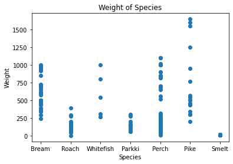
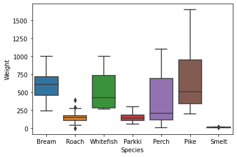

# 데이터 프레임  가져오기


```python
import numpy as np
import pandas as pd
```


```python
df_fish = pd.read_csv("Fish.csv")
```

# 데이터 확인


```python
df_fish.head()
```


<div>
<style scoped>
    .dataframe tbody tr th:only-of-type {
        vertical-align: middle;
    }

    .dataframe tbody tr th {
        vertical-align: top;
    }

    .dataframe thead th {
        text-align: right;
    }
</style>
<table border="1" class="dataframe">
  <thead>
    <tr style="text-align: right;">
      <th></th>
      <th>Species</th>
      <th>Weight</th>
      <th>Length1</th>
      <th>Length2</th>
      <th>Length3</th>
      <th>Height</th>
      <th>Width</th>
    </tr>
  </thead>
  <tbody>
    <tr>
      <th>0</th>
      <td>Bream</td>
      <td>242.0</td>
      <td>23.2</td>
      <td>25.4</td>
      <td>30.0</td>
      <td>11.5200</td>
      <td>4.0200</td>
    </tr>
    <tr>
      <th>1</th>
      <td>Bream</td>
      <td>290.0</td>
      <td>24.0</td>
      <td>26.3</td>
      <td>31.2</td>
      <td>12.4800</td>
      <td>4.3056</td>
    </tr>
    <tr>
      <th>2</th>
      <td>Bream</td>
      <td>340.0</td>
      <td>23.9</td>
      <td>26.5</td>
      <td>31.1</td>
      <td>12.3778</td>
      <td>4.6961</td>
    </tr>
    <tr>
      <th>3</th>
      <td>Bream</td>
      <td>363.0</td>
      <td>26.3</td>
      <td>29.0</td>
      <td>33.5</td>
      <td>12.7300</td>
      <td>4.4555</td>
    </tr>
    <tr>
      <th>4</th>
      <td>Bream</td>
      <td>430.0</td>
      <td>26.5</td>
      <td>29.0</td>
      <td>34.0</td>
      <td>12.4440</td>
      <td>5.1340</td>
    </tr>
  </tbody>
</table>
</div>


```python
df_fish.shape
```


    (159, 7)


```python
df_fish.isnull().sum().sum()
```


    0


# 그래프를 통한 데이터 확인


```python
import seaborn as sns
import matplotlib.pyplot as plt

X=df_fish["Weight"]
y=df_fish.iloc[1:]
target=df_fish["Species"]
plt.scatter(target, X)
plt.xlabel("Species")
plt.ylabel("Weight")
plt.title("Weight of Species")
plt.show()
```


    

    


```python
sns.boxplot(x="Species", y="Weight", data=df_fish)
plt.show()
```


    

    


# KNeighborsRegressor


```python
from sklearn.neighbors import KNeighborsRegressor
from sklearn.model_selection import train_test_split

knr = KNeighborsRegressor()
x_train, x_test, y_train, y_test = train_test_split(df_fish["Length1"], df_fish["Weight"], test_size=0.2)
x_train = np.array(x_train).reshape(-1,1)
x_test = np.array(x_test).reshape(-1,1)
knr.fit(x_train, y_train)
```


    KNeighborsRegressor()


# 결정계수


```python
print(knr.score(x_test, y_test))
```

    0.7707551076318342


```python
from sklearn.metrics import mean_absolute_error

test_prediction = knr.predict(x_test)
mae = mean_absolute_error(y_test, test_prediction) #실제값과 측정값을 빼주는 것(절대값 오차)
print(mae)
```

    83.92187499999999

