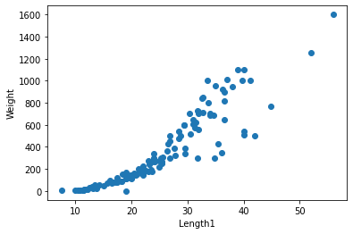

```python
import numpy as np
import pandas as pd
```


```python
df_fish = pd.read_csv("Fish.csv")
df_fish.shape
```


    (159, 7)


```python
df_fish.describe
```


    <bound method NDFrame.describe of     Species  Weight  Length1  Length2  Length3   Height   Width
    0     Bream   242.0     23.2     25.4     30.0  11.5200  4.0200
    1     Bream   290.0     24.0     26.3     31.2  12.4800  4.3056
    2     Bream   340.0     23.9     26.5     31.1  12.3778  4.6961
    3     Bream   363.0     26.3     29.0     33.5  12.7300  4.4555
    4     Bream   430.0     26.5     29.0     34.0  12.4440  5.1340
    ..      ...     ...      ...      ...      ...      ...     ...
    154   Smelt    12.2     11.5     12.2     13.4   2.0904  1.3936
    155   Smelt    13.4     11.7     12.4     13.5   2.4300  1.2690
    156   Smelt    12.2     12.1     13.0     13.8   2.2770  1.2558
    157   Smelt    19.7     13.2     14.3     15.2   2.8728  2.0672
    158   Smelt    19.9     13.8     15.0     16.2   2.9322  1.8792
    
    [159 rows x 7 columns]>


```python
df_fish.info
```


    <bound method DataFrame.info of     Species  Weight  Length1  Length2  Length3   Height   Width
    0     Bream   242.0     23.2     25.4     30.0  11.5200  4.0200
    1     Bream   290.0     24.0     26.3     31.2  12.4800  4.3056
    2     Bream   340.0     23.9     26.5     31.1  12.3778  4.6961
    3     Bream   363.0     26.3     29.0     33.5  12.7300  4.4555
    4     Bream   430.0     26.5     29.0     34.0  12.4440  5.1340
    ..      ...     ...      ...      ...      ...      ...     ...
    154   Smelt    12.2     11.5     12.2     13.4   2.0904  1.3936
    155   Smelt    13.4     11.7     12.4     13.5   2.4300  1.2690
    156   Smelt    12.2     12.1     13.0     13.8   2.2770  1.2558
    157   Smelt    19.7     13.2     14.3     15.2   2.8728  2.0672
    158   Smelt    19.9     13.8     15.0     16.2   2.9322  1.8792
    
    [159 rows x 7 columns]>


```python
df_fish.isnull().sum().sum()
```


    0


# LinearRegression


```python
from sklearn.linear_model import LinearRegression
from sklearn.model_selection import train_test_split

x_train, x_test, y_train, y_test = train_test_split(df_fish["Length1"], df_fish["Weight"], test_size = 0.2)
```


```python
x_train = np.array(x_train).reshape(-1,1)
x_test = np.array(x_test).reshape(-1,1)
```


```python
lr = LinearRegression()
lr.fit(x_train, y_train)
```


    LinearRegression()


```python
x_train.shape
```


    (127, 1)


```python
y_train.shape
```


    (127,)


```python
print(lr.coef_, lr.intercept_)
```

    [32.38721101] -453.45153724024965


```python
import matplotlib.pyplot as plt

plt.scatter(x_train, y_train)
plt.xlabel("Length1")
plt.ylabel("Weight")
plt.show()
```


    

    


```python
print(lr.score(x_test, y_test))
```

    0.8358382200579473


# 다항 회귀


```python
poly_train = np.column_stack((x_train ** 2, x_train))
poly_test = np.column_stack((x_test ** 2, x_test))
```


```python
lr_poly = LinearRegression()
lr_poly.fit(poly_train, y_train)
```


    LinearRegression()


```python
print(lr_poly.score(poly_train, y_train))
print(lr_poly.score(poly_test, y_test))
```

    0.8390374463472161
    0.8398061709143936

